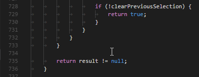

# Formatting

This repo contains instructions and a command line tool to help achieve consistent formatting for hso-autonomy projects (in an IDE-independent way). For Java/C++ files, [clang-format](https://clang.llvm.org/docs/ClangFormat.html) is used.

## Setup

- clone this repository
- run `java -jar clangFormatWrapper.jar --init <project dir(s)>` (where `<project dir(s)>` is one or multiple project directories to which to add the config files)
- if Git shows any of the added files as "untracked", add them to the `.gitignore`

## IDE Setup

These instructions assume that the earlier, general setup has already been done.

### IntelliJ IDEA

(these instructions should work for all IDEA-based IDEs, including CLion / PyCharm)

- install the [File Watchers plugin](https://plugins.jetbrains.com/plugin/7177-file-watchers): `File|Settings|Plugins|Browse Repositories...`, then search for "File Watchers" and install it
- after restarting IDEA, making a change to a file and pressing <kbd>Ctrl</kbd>+<kbd>S</kbd> should trigger a reformat:

  

### Visual Studio Code

- install the [Clang-Format extension](https://marketplace.visualstudio.com/items?itemName=xaver.clang-format) (`View|Extensions`, search for "clang-format")
- enable format-on-save by adding this to `settings.json` (`File|Preferences|Settings`):

  ```json
  "editor.formatOnSave": true
  ```

- also set the `"clang-format.executable"` path (on Windows, escape `\` with `\\`!), or make sure `clang-format` is in your `PATH`
- after restarting VSCode, making a change to a file and pressing <kbd>Ctrl</kbd>+<kbd>S</kbd> should trigger a reformat:

  

## Known issues

clang-format primarily being a C++ formatter, it has issues with some Java constructs. It sometimes puts a space before `::` of Java 8 method references:

```java
this ::foo
String[] ::new
```

It also doesn't appear to have an option to add a line break before the `{` in interface declarations, so they will always be formatted like this:

```java
public interface Foo {
    void bar();
}
```

Overall it works very well, however.