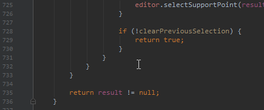

# Formatting

This repo contains instructions and a command line tool to help achieve consistent formatting for hso-autonomy projects (in an IDE-independent way). For Java/C++ files, [clang-format](https://clang.llvm.org/docs/ClangFormat.html) is used.

## Setup

- Clone this repository.
- Run `java -jar clangFormatWrapper.jar --init <project dir(s)>` (where `<project dir(s)>` is one or multiple project directories to which to add the config files). This should be done again when there are changes to the config / this repo.

In case the repository has not been set up for formatting yet:

- Add the following to `.gitignore`:

  ```
  .idea
  .clang-format
  *.TMP
  *.java-*
  ```

  If an Eclipse `.project` file is committed, the changes to it, as well as `.externalToolBuilders/clang-format.launch`, should be committed as well.

- Run `java -jar clangFormatWrapper.jar <project dir(s)>` (same as before, but without `--init`) to recursively reformat all source files in the repo.

## IDE Setup

These instructions assume that the earlier, general setup has already been done.

### IntelliJ IDEA

(these instructions should work for all IDEA-based IDEs, including CLion / PyCharm)

- Install the [File Watchers plugin](https://plugins.jetbrains.com/plugin/7177-file-watchers): `File|Settings|Plugins|Browse Repositories...`, then search for "File Watchers" and install it.
- After restarting IDEA, making a change to a file and pressing <kbd>Ctrl</kbd>+<kbd>S</kbd> should trigger a reformat:

  

## Eclipse

- Make sure that `clang-format` is in your `PATH` (see [/binaries](/binaries)) (a reboot may be required for Eclipse to pick up the changes).
- Enable "Build Automatically" in `Window|Preferences|General|Workspace` (otherwise formatting only happens when running the project, not on save).
- Making a change to a file and pressing <kbd>Ctrl</kbd>+<kbd>S</kbd> should now trigger a reformat:

  

### Visual Studio Code

- Install the [Clang-Format extension](https://marketplace.visualstudio.com/items?itemName=xaver.clang-format) (`View|Extensions`, search for "clang-format")
- enable format-on-save by adding this to `settings.json` (`File|Preferences|Settings`):

  ```json
  "editor.formatOnSave": true
  ```

- Also set the `"clang-format.executable"` path (on Windows, escape `\` with `\\`!), or make sure `clang-format` is in your `PATH`.
- After restarting VSCode, making a change to a file and pressing <kbd>Ctrl</kbd>+<kbd>S</kbd> should trigger a reformat:

  

## Known issues

- On Windows, clang-format may create `TMP` files next to source files sometimes (such as `WorldModel.java~RF3494d0.TMP`). This is why `*.TMP` should be added to `.gitignore` as instructed earlier. More info [here](https://bugs.llvm.org//show_bug.cgi?id=26286).

- clang-format primarily being a C++ formatter, it has issues with some Java constructs. It sometimes puts a space before `::` of Java 8 method references:

  ```java
  this ::foo
  String[] ::new
  ```

- clang-format also doesn't appear to have an option to add a line break before the `{` in interface declarations, so they will always be formatted like this:

  ```java
  public interface Foo {
      void bar();
  }
  ```

Overall it works very well, however.